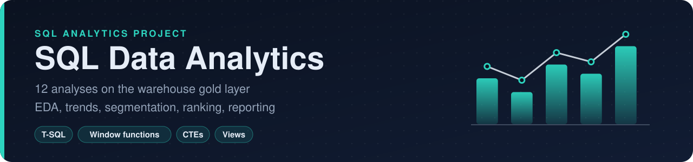

<p align="center">
  
</p>

<p align="center">

   

</p>

A set of SQL Server scripts that apply exploratory analysis, advanced analytics and business reporting to the **Gold Layer** of the [Data Warehouse Project](https://github.com/Supaisu/sql-data-warehouse-project).

---

## Project Overview

This project is structured around three phases of data analysis:

1. **Exploratory Data Analysis (EDA):** Initial exploration of the data to understand its structure, quality, and key characteristics.
2. **Advanced Analytics:** Applying analytical techniques such as trend analysis, cumulative metrics, segmentation, and ranking to uncover deeper insights.
3. **Business Reporting:** Building SQL-based reports for customer and product performance to support strategic decision-making.

---

## Repository Structure

```
sql-data-analytics-project/
│
├── scripts/   # Run in numbered order
│   ├── 01_dimensions_exploration.sql
│   ├── 02_date_exploration.sql
│   ├── 03_measure_exploration.sql
│   ├── 04_magnitude_analysis.sql
│   ├── 05_ranking_analysis.sql
│   ├── 06_change_over_time_trends.sql
│   ├── 07_cumulative_analysis.sql
│   ├── 08_performance_analysis.sql
│   ├── 09_data_segmentation.sql
│   ├── 10_part_to_whole_analysis.sql
│   ├── 11_customer_report.sql
│   ├── 12_product_report.sql
│
├── README.md
└── LICENSE
```

---

## Analytical Techniques Covered

| # | Technique | Script | Description |
|---|---|---|---|
| 1 | EDA – Dimensions | [`01_dimensions_exploration.sql`](scripts/01_dimensions_exploration.sql) | Profiling dimension tables and categorical attributes |
| 2 | EDA – Dates | [`02_date_exploration.sql`](scripts/02_date_exploration.sql) | Exploring date ranges, gaps, and time-based patterns |
| 3 | EDA – Measures | [`03_measure_exploration.sql`](scripts/03_measure_exploration.sql) | Summarising key numeric measures (total sales, orders, customers) |
| 4 | Magnitude Analysis | [`04_magnitude_analysis.sql`](scripts/04_magnitude_analysis.sql) | Comparing measures across countries, categories and customers |
| 5 | Ranking Analysis | [`05_ranking_analysis.sql`](scripts/05_ranking_analysis.sql) | Top-N and bottom-N products and customers using window functions |
| 6 | Trend Analysis | [`06_change_over_time_trends.sql`](scripts/06_change_over_time_trends.sql) | Monthly and yearly sales, customer and quantity trends |
| 7 | Cumulative Analysis | [`07_cumulative_analysis.sql`](scripts/07_cumulative_analysis.sql) | Running totals and moving averages |
| 8 | Performance Analysis | [`08_performance_analysis.sql`](scripts/08_performance_analysis.sql) | Year-over-year and vs-average product performance |
| 9 | Segmentation | [`09_data_segmentation.sql`](scripts/09_data_segmentation.sql) | Grouping products by cost band and customers into VIP / Regular / New |
| 10 | Part-to-Whole | [`10_part_to_whole_analysis.sql`](scripts/10_part_to_whole_analysis.sql) | Each category's percentage contribution to total sales |
| 11 | Customer Report | [`11_customer_report.sql`](scripts/11_customer_report.sql) | `gold.report_customers` view: segments, recency, AOV, monthly spend |
| 12 | Product Report | [`12_product_report.sql`](scripts/12_product_report.sql) | `gold.report_products` view: product segments, revenue, recency, average selling price |

---

## How to Run

1. Build the warehouse first by following the steps in the [SQL Data Warehouse Project](https://github.com/Supaisu/sql-data-warehouse-project#how-to-run).
2. Open SSMS, connect to the `DataWarehouse` database, and run the scripts in `scripts/` in numbered order.
3. Scripts 11 and 12 create reusable reporting views (`gold.report_customers`, `gold.report_products`) that can be connected directly to Power BI or Excel.

---

## Data Source

All scripts query the **Gold Layer** tables from the [SQL Data Warehouse Project](https://github.com/Supaisu/sql-data-warehouse-project), which follows a star schema with:

- `gold.dim_customers` — Customer dimension
- `gold.dim_products` — Product dimension
- `gold.fact_sales` — Sales fact table

---

## Tools & Technologies

- **SQL Server Express:** Database engine
- **SQL Server Management Studio (SSMS):** Query development and execution
- **Git & GitHub:** Version control and collaboration

---

## License

This project is licensed under the [MIT License](LICENSE). You are free to use, modify, and share this project with proper attribution.

---

## Acknowledgements

This project was built by following the [Data With Baraa](https://github.com/DataWithBaraa/sql-data-analytics-project) SQL Data Analytics course.

---

## About Me

Data analyst with a BSc in Accounting and Finance (Royal Holloway) and an MSc in Computer Science with Data Analytics (University of York), focused on turning raw data into clear business insight.

- [LinkedIn](https://www.linkedin.com/in/umaircadir/)
- [GitHub](https://github.com/Supaisu)
